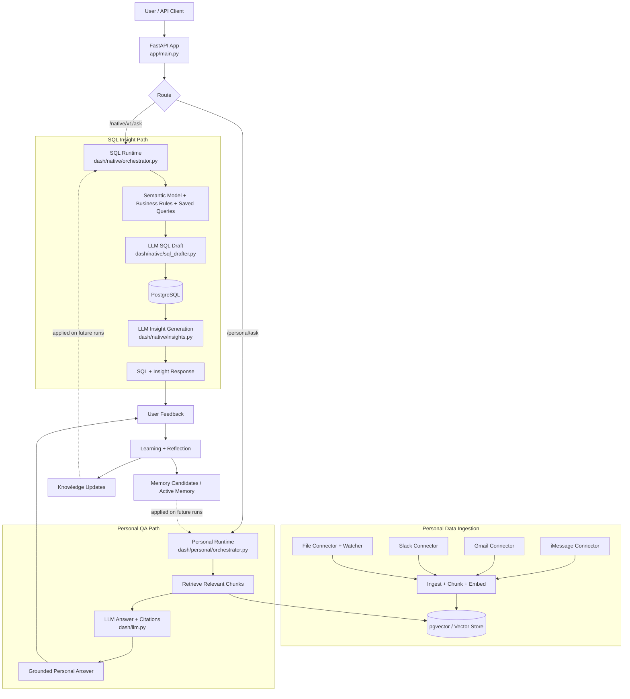

# Vault

A **self-learning personal data agent** that lives on your machine. It indexes your iMessages, Gmail, and local files, then answers questions with cited evidence — improving automatically with every interaction.

Inspired by [OpenAI's in-house data agent](https://openai.com/index/inside-our-in-house-data-agent/).

## What It Does

- **Ask questions** across your iMessages, emails, and files in natural language
- **SQL data agent** for structured database queries with insight generation
- **Auto-indexes** new and modified files in real-time via file watcher
- **Self-learning memory** — learns from feedback, never repeats the same mistakes
- **Fully local** — your data never leaves your machine

## Quick Start

```sh
# 1. Clone and configure
git clone <repo-url> && cd vault
cp .env.example .env   # Add your API keys

# 2. Start everything
docker compose up -d --build

# 3. Verify
curl http://localhost:8000/health
```

Open [http://localhost:8000/docs](http://localhost:8000/docs) to explore the API.

## Architecture

### Overall Agent Flow



The API routes into one of two runtimes (personal QA or SQL insight), each grounded in stored context, with feedback feeding a learning loop that improves future responses.

```
vault/
├── native/              # SQL data agent runtime
│   ├── orchestrator.py  # Query → SQL → Execute → Insight pipeline
│   ├── sql_drafter.py   # LLM-powered SQL generation
│   ├── insights.py      # LLM-powered result interpretation
│   └── store.py         # Run telemetry and learning persistence
├── personal/            # Personal data agent runtime
│   ├── orchestrator.py  # Question → Retrieve → Cite → Answer
│   ├── memory.py        # Memory lifecycle (proposed→approved→active→stale→deprecated)
│   ├── learning.py      # Reflection engine (auto-generates memory candidates)
│   ├── watcher.py       # Real-time file watcher (macOS FSEvents)
│   └── connectors/      # Data source connectors
│       ├── gmail.py     # Gmail (OAuth refresh token)
│       ├── imessage.py  # iMessage (local SQLite)
│       ├── files.py     # Local files (Documents, Desktop, Downloads, etc.)
│       └── slack.py     # Slack (user token)
├── llm.py               # Model-agnostic LLM calls (litellm)
├── embedder.py          # Local embeddings (FastEmbed, BAAI/bge-small-en-v1.5)
├── vectordb.py          # pgvector hybrid search (cosine + full-text)
└── context/             # SQL context layers
    ├── semantic_model.py
    └── business_rules.py

app/
├── main.py              # FastAPI entry point + file watcher lifecycle

db/
├── session.py           # PostgreSQL session factory (SQLAlchemy)
└── url.py               # Database URL builder
```

**No agent framework.** Custom orchestration with FastAPI + litellm + fastembed. Model-agnostic — works with OpenAI, Anthropic, Ollama, or any litellm-compatible provider.

## Data Connectors

| Source | Auth | What It Reads |
|--------|------|---------------|
| **iMessage** | Full Disk Access (macOS) | All messages from `~/Library/Messages/chat.db` |
| **Gmail** | OAuth refresh token | Emails via Gmail REST API |
| **Files** | None (local) | Documents, code, PDFs, notebooks across `~/Documents`, `~/Desktop`, `~/Downloads`, etc. |
| **Slack** | User token (`xoxp-`) | Channel and DM history |

### File Watcher

When the API server is running, new or modified files in your watched directories are **auto-indexed within 5 seconds**:

```
File saved → FSEvents → debounce (5s) → read → chunk → embed → pgvector
```

Supports 50+ file types: `.py`, `.js`, `.ts`, `.md`, `.pdf`, `.csv`, `.json`, `.sql`, `.ipynb`, `.docx`, `.xlsx`, and more. Skips binaries, media, `node_modules`, `.git`, and other junk automatically.

## Connector Setup

### iMessage (macOS)

No configuration needed if your terminal has **Full Disk Access**:

1. System Settings → Privacy & Security → Full Disk Access
2. Enable your terminal app (Terminal.app, iTerm2, etc.)
3. Vault reads `~/Library/Messages/chat.db` directly

### Gmail

1. Create a **Google Cloud project** and enable the Gmail API
2. Create an **OAuth 2.0 Web Application** client
3. Add `http://localhost:8085` as an authorized redirect URI
4. Set credentials in `.env`:

```sh
GMAIL_CLIENT_ID=your-client-id.apps.googleusercontent.com
GMAIL_CLIENT_SECRET=GOCSPX-...
GMAIL_REFRESH_TOKEN=1//...   # See scripts/gmail_auth.py
```

### Local Files

Auto-scans `~/Documents`, `~/Desktop`, `~/Downloads`, and other common directories. Override with:

```sh
VAULT_FILES_SCAN_DIRS=Documents,Desktop,Downloads,Projects,Code
```

### Slack

1. Create a Slack app at [api.slack.com/apps](https://api.slack.com/apps)
2. Add User Token Scopes: `channels:history`, `channels:read`, `users:read`
3. Install to workspace and copy the `xoxp-` token
4. Set in `.env`:

```sh
SLACK_USER_TOKEN=xoxp-...
SLACK_CONVERSATIONS=C12345,D12345
```

## Self-Learning System

Vault has two complementary learning systems:

| System | What It Stores | How It Evolves |
|--------|---------------|----------------|
| **Knowledge** | Validated queries, table metadata, business rules | Curated by you + Vault |
| **Memory** | Error patterns, user preferences, source quirks | Discovered automatically via reflection |

### Memory Lifecycle

```
Interaction → Reflection Engine → Memory Candidate (proposed)
                                       ↓
                              Review → Approve / Reject
                                       ↓
                              Active Memory (used in future queries)
                                       ↓
                              Stale → Deprecated (if contradicted)
```

Memory candidates are typed: `ReasoningRule`, `SourceQuirk`, `GuardrailException`, `UserPreference`.

## API Endpoints

### SQL Data Agent (`/native/v1`)

| Endpoint | Description |
|----------|-------------|
| `POST /native/v1/ask` | Ask a data question → SQL → insight |
| `POST /native/v1/feedback` | Submit feedback on a response |
| `POST /native/v1/save-query` | Save a validated SQL query |
| `POST /native/v1/evals/run` | Run evaluation suite |

### Personal Data Agent (`/native/v1/personal`)

| Endpoint | Description |
|----------|-------------|
| `POST /personal/ask` | Ask across personal data sources |
| `GET /personal/sources/status` | List connector status |
| `POST /personal/sources/{source}/sync` | Trigger source sync |
| `GET /personal/watcher/status` | File watcher status |
| `GET /personal/memory/candidates` | List memory candidates |
| `POST /personal/memory/candidates/{id}/approve` | Approve memory |
| `GET /personal/memory/active` | List active memories |
| `POST /personal/feedback` | Submit feedback + generate memory candidates |

## Environment Variables

| Variable | Required | Description |
|----------|----------|-------------|
| `OPENAI_API_KEY` | Yes* | OpenAI API key |
| `ANTHROPIC_API_KEY` | Yes* | Anthropic API key |
| `VAULT_LLM_MODEL` | No | LLM model (default: `gpt-4o`, any litellm-compatible) |
| `VAULT_EMBED_BACKEND` | No | `local` (default, free) or `openai` |
| `GMAIL_CLIENT_ID` | No | Gmail OAuth client ID |
| `GMAIL_CLIENT_SECRET` | No | Gmail OAuth client secret |
| `GMAIL_REFRESH_TOKEN` | No | Gmail OAuth refresh token |
| `SLACK_USER_TOKEN` | No | Slack user token |
| `IMESSAGE_DB_PATH` | No | iMessage DB path (default: `~/Library/Messages/chat.db`) |
| `VAULT_FILES_SCAN_DIRS` | No | Comma-separated dirs to watch/scan |
| `VAULT_FILES_MAX_SIZE` | No | Max file size to index (default: 10MB) |
| `VAULT_WATCHER_DEBOUNCE` | No | Seconds to wait before indexing (default: 5) |

*At least one LLM API key required.

## Local Development

```sh
# Set up virtual environment
./scripts/venv_setup.sh && source .venv/bin/activate

# Start just the database
docker compose up -d vault-db

# Load sample data and knowledge
python -m vault.scripts.load_data
python -m vault.scripts.load_knowledge

# Run CLI
python -m vault

# Run API server
uvicorn app.main:app --reload
```

## Tech Stack

| Component | Technology |
|-----------|-----------|
| LLM | litellm (OpenAI, Anthropic, Ollama, etc.) |
| Embeddings | FastEmbed (BAAI/bge-small-en-v1.5, local, free) |
| Vector DB | pgvector (Postgres extension) |
| API | FastAPI |
| Database | PostgreSQL 17 + SQLAlchemy |
| File Watch | watchdog (macOS FSEvents) |
| Containers | Docker Compose |

## Further Reading

- [OpenAI's In-House Data Agent](https://openai.com/index/inside-our-in-house-data-agent/) — the inspiration
